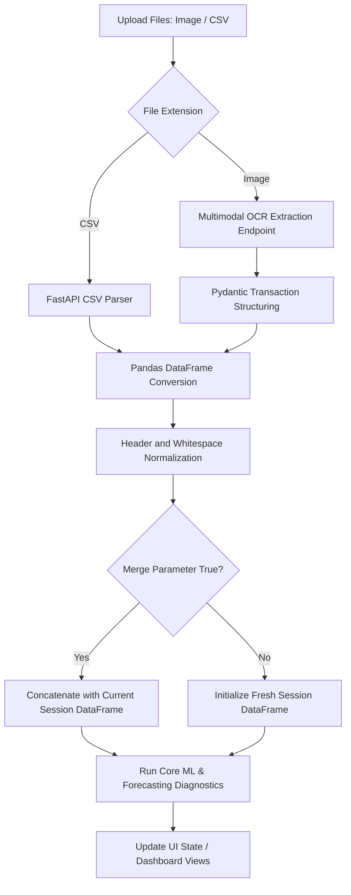

# ProfitPilot

ProfitPilot is an artificial intelligence-powered financial intelligence platform that transforms raw ledger images and transaction data into structured business insights. By integrating multimodal document extraction with traditional machine learning models, the platform detects financial anomalies, forecasts net profits, and answers conversational queries based on historical business performance.

[](https://ai.google.dev/gemma)
[](https://scikit-learn.org/)
[](https://github.com/facebookresearch/faiss)
[](https://huggingface.co/)
[](https://fastapi.tiangolo.com)

---

## Key Features

* **Intelligent Document Ingestion (OCR)**: Automatically processes photographs or scans of invoices and handwritten ledger logs to isolate tabular transaction parameters (dates, customers, products, revenue, costs, discounts, payment cycles) using multimodal vision analysis.
* **Multi-File Sequential Merging**: Allows uploading mixed batches of CSV files and images simultaneously. The ingestion pipeline normalizes schemas and combines the rows into a single target dataset for holistic analysis.
* **Goal-Aware Recommendations**: Replaces generic advice lists with custom-tailored strategy actions and badges keyed specifically to the user's active business targets.
* **Retrieval-Augmented Generation (RAG)**: Connects conversations to a localized financial knowledge base via vector search, grounding the business advisor in verified industry best practices.
* **Active Business Goal Targets**: Lets users specify deadlines, target values, and current progress metrics directly, updating a visual progress bar.
* **Conversational Chat Sessions**: Preserves and loads historical messages and the dashboard data associated with each chat session across refreshes.
* **Interactive Onboarding Walkthrough**: Guides first-time users through the dashboard layout using a backdrop dimming spotlight effect to focus on primary modules.
* **Interactive What-If Simulation**: Enables simulating the impact of price adjustments and discount policy changes on revenue and profit margins using real-time sliders.

---

## Technology Stack

* **Google GenAI SDK (Multimodal OCR & Chat)**: Utilized to parse unstructured ledger images into structured transaction records with a multimodal vision model, and to host a conversational business advisor capable of reasoning.
* **FAISS (Facebook AI Similarity Search)**: Deployed as an in-memory vector database to store and perform similarity searches on chunked financial textbooks and standard operating procedures.
* **Hugging Face (Sentence Transformers)**: Used to generate dense vector embeddings for documents indexed in the FAISS vector database to support precise Retrieval-Augmented Generation (RAG).
* **Scikit-Learn (Anomaly Detection & Regression)**: Leveraged for the core machine learning models, deploying Isolation Forests to isolate pricing leakages and Random Forest Regressors to predict upcoming profit trends.
* **Python & FastAPI**: Selected to build the async backend, enabling fast parallel calculations and offering native support for standard data science libraries (Pandas, NumPy, Scikit-Learn).

---

## System Architecture

The following diagram illustrates the ingestion, merging, and diagnostic pipeline:



### Visual Interface Reference


---

## Machine Learning Methodology

### 1. Anomaly-Based Profit Leakage (Isolation Forest)
The system employs an `IsolationForest` algorithm to identify transactions that generate suboptimal returns. 
* **Feature Vector**: The model trains on three primary metrics: transaction revenue, applied discount percentages, and final profit margins.
* **Isolation Mechanics**: By recursively partitioning feature spaces, anomalous transactions (such as extreme discount percentages on high-volume products) are isolated closer to the root of the decision trees. Items with low average path lengths are highlighted as critical profit leaks.

### 2. Profit Forecasting (Random Forest Regressor)
To predict net earnings for the upcoming month, the system deploys a `RandomForestRegressor`.
* **Data Preprocessing**: Transaction dates are parsed and aggregated into monthly bins. These dates are mapped onto numerical time steps.
* **Prediction Mechanics**: An ensemble of decision tree estimators fits the historical trend line. The regressor extrapolates the timeline by one time step, predicting the upcoming month's net profit margin.

---

## Integration Challenges

### 1. Multimodal Document Data Normalization
A major challenge involved the variance of extracted tables returned by the vision parser. Different documents yielded different column formats, uppercase headers, or malformed values (such as dates with missing components like `1968-06-00`). To resolve this, the backend normalizes all text to lowercase, strips trailing whitespaces, and runs defensive checks to replace parsing anomalies with valid parameters before training the models.

### 2. Multi-File Session Merging
Processing mixed uploads of CSVs and images in a single step is complex because visual extraction and spreadsheet parsers operate differently. We solved this by implementing a sequential upload loop on the client. The first file overrides previous session states to initiate a new session, while subsequent files in the same batch send a `merge=true` flag. The backend appends these incoming datasets to the existing in-memory DataFrame dynamically.

---

## Setup and Installation

### Backend Setup
1. Navigate to the backend directory:
   ```bash
   cd backend
   ```
2. Install Python dependencies:
   ```bash
   pip install -r requirements.txt
   ```
3. Configure environment variables in a `.env` file:
   ```env
   GOOGLE_API_KEY=your_api_key
   MODEL_NAME=gemini-1.5-flash
   VISION_MODEL_NAME=gemini-1.5-flash
   ```
4. Start the server:
   ```bash
   uvicorn app.main:app --reload
   ```

### Frontend Setup
1. Navigate to the frontend directory:
   ```bash
   cd frontend
   ```
2. Install dependencies:
   ```bash
   npm install
   ```
3. Launch the development server:
   ```bash
   npm run dev
   ```
